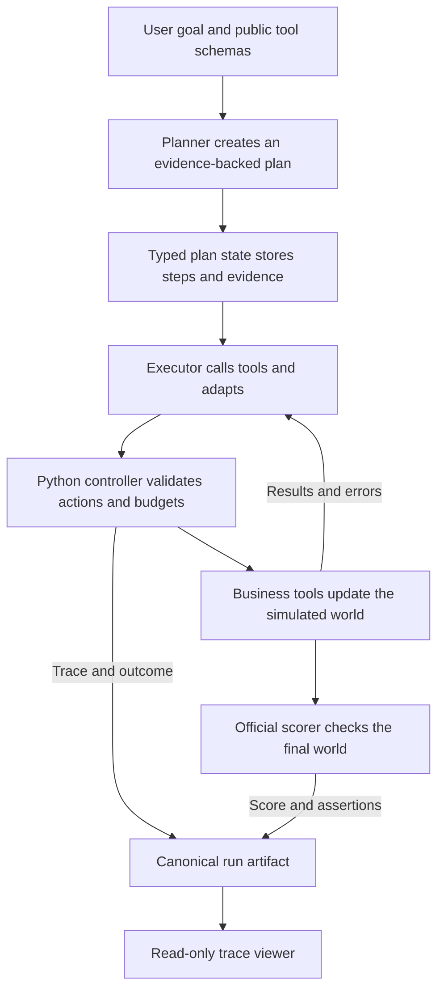

# Sales Plan-State Agent

This is a framework-free Python agent for long-running, multi-step Sales workflows in noisy cross-application environments. Given a high-level task and a set of public tools, it creates an evidence-backed plan, executes it through a continuous ReAct-style loop, revises the plan when new information invalidates it, and returns an inspectable result. Tested with AutomationBench, a framework that provides isolated simulated worlds and deterministic scoring, while its assertions, expected values, and raw world state remain hidden from the model.

## How the agent works



The agent separates model judgment from deterministic control. The model decides what work is needed and which business tools to call; a custom Python controller owns state transitions, tool validation, recovery, execution limits, termination, and tracing.

1. **Plan.** The planner receives the task prompt and the schemas of the tools available for that task. In one tools-disabled structured call, it creates the smallest cohesive linear plan it can, up to six steps. Every step defines observable completion evidence and names the tools capable of producing it.

2. **Execute.** The executor works through one continuous loop. On each turn it can either issue a sequential batch of business-tool calls or use exactly one harness control: `complete_step`, `revise_plan`, or `finish`. Mixing business calls and control actions is rejected before any side effect occurs.

3. **Ground progress in evidence.** A step cannot be completed from a narrative claim alone. The executor must map every evidence requirement to a compatible, successful tool call made while that step was active. The typed plan state validates those references and retains accepted facts and a ledger of successful calls.

4. **Adapt without forgetting completed work.** If a discovery makes the remaining plan incorrect, the executor can revise it. Completed steps, accepted evidence, and successful side effects remain immutable; the active step is explicitly failed or superseded, and only the remaining work is replaced. This lets the agent adapt without restarting or repeating mutations.

5. **Recover and stop predictably.** Unknown tools, invalid arguments, tool-reported failures, tool exceptions, stale plan revisions, and invalid evidence are returned as structured observations so the model can correct itself. One central run budget limits model turns, tool calls, plan revisions, elapsed time, and consecutive no-progress turns. If a budget or deadline is exhausted, one tools-disabled finalization call returns an honest partial or blocked result instead of allowing an unbounded loop.

6. **Keep evaluation blind and observable.** A private adapter owns the task identity, benchmark assertions, expected values, mutable world, and official scorer. The model sees only the task prompt, public tool schemas, observed results and errors, current plan state, accepted evidence, and remaining budgets. After termination, the official scorer evaluates the final world, and the complete correlated trace, outcome, score, assertions, usage, timing, and initial/final worlds are stored in one canonical run artifact that the read-only viewer displays directly.

The immutable trace is intentionally more complete than the context shown to the model. This preserves auditability without treating the full execution log as memory: the model receives the current plan, the facts it has established, the successful-call ledger, and relevant recovery observations, while the artifact retains every model turn, tool call, result, error, transition, correlation ID, and duration.

## Key decisions and why

- **Let the evaluation methodology shape the problem.** Rather than inventing a small test set and an informal success criterion, I selected AutomationBench because it provides demanding multi-application tasks, noisy tool environments, fresh simulated state, and deterministic assertions. This made it possible to test both correctness and reliability while keeping the agent blind to the answers.

- **Use the framework prototype only to de-risk the benchmark.** The repository began with a LangGraph-based mock agent so I could verify task loading, tool binding, world mutation, scoring, and trace requirements before investing in the final harness. Once that boundary was understood, the submission runtime was rebuilt against the provider SDK directly. This kept the benchmark integration learned during the spike without outsourcing the control loop, prompts, recovery, or context policy to an agent framework.

- **Put judgment in the model and invariants in Python.** Planning, tool selection, and adaptation benefit from model judgment. Evidence provenance, plan transitions, execution budgets, tool argument validation, and terminal classification need predictable semantics. Keeping that boundary explicit makes failures inspectable and prevents a persuasive model response from silently becoming proof that the work was completed.

- **Replace the planner–executor–reviewer architecture when diagnostics showed it was too complicated.** The first framework-free design used a planner, a per-step executor loop, and a separate reviewer after every step. A complex Sales diagnostic showed the executor could spend all four permitted turns doing valid tool work and then run out of budget before it could hand an outcome to the reviewer; the architecture also accumulated nested retry, review, replan, and finalization loops. I first hardened those handoffs, then used the result to identify the more important simplification: the final architecture keeps one initial planner but replaces per-step reviewer calls with a continuous executor and locally validated plan controls. Replanning and recovery remain, but they now operate through one typed plan state and one run-level budget rather than nested model loops.

- **Require evidence without exposing benchmark answers.** The controller validates completion against successful tool-call provenance, not against AutomationBench assertions. This gives the agent a meaningful internal definition of progress while preserving evaluation blindness. It also keeps the official score independent from the agent's own completion claim, which is important because a run can terminate normally and still leave the world in an incorrect state.

- **Protect side effects more strongly than reads.** Business-tool mutations are never retried automatically by Python. Successful calls remain visible across plan revisions so the model can avoid repeating them, while transient provider failures receive only a small, visible retry allowance. This is a deliberately modest safety model: enough to prevent the harness itself from duplicating actions, without introducing a general idempotency platform for a simulated case study.

- **Treat observability as evidence, not as a second product.** The original UI grew to own execution, streaming, reconnection, cancellation, history, responsive layouts, and its own session representation. That work clarified what an evaluator actually needs, after which I removed most of the product surface. The final viewer is read-only and derives everything from the same canonical run artifact used by the CLI, evaluator, and report generator. One atomic, write-once artifact per terminal run avoids schema drift, duplicate histories, and UI-owned truth while preserving the plan, correlated trace, outcome, score, and world evidence.

- **Prefer a sequential, resumable evaluation over evaluation infrastructure.** Every repetition begins with a fresh world and is persisted before the next run. Resumption skips only an already-scorable configuration/task/repetition triple, final reports reject incomplete or mixed-configuration panels, and explicitly filtered reports are labeled exploratory. Infrastructure-invalid attempts are replaced only within a fixed bound, while agent-caused failures remain part of the score. This makes a long evaluation interruption-safe and difficult to cherry-pick without adding workers, queues, a database, or a live dashboard.

- **Freeze behavior and keep the scope narrow.** Runtime, prompt, model, and evaluation-protocol versions are recorded with every observation so incompatible runs cannot be silently combined. I deliberately left out long-term memory, retrieval, subagents, DAG scheduling, multi-provider routing, MCP transport, a database, and automatic prompt optimization. None was necessary to demonstrate the part being evaluated: how the harness plans, manages context, uses tools, adapts, terminates, and exposes evidence.

### What I would do with more time

1. **A test framework suitable for text generation.** Honing the test framework means adapting it to non-deterministic tasks. For instance, in this opportunity, the generation tasks were not evaluated, but we rather calculated assertions based on the final state of things, which is okay for an operational agent. In another scenario, for example, a draft generator agent, which is very typical in the legal industry, you have to evaluate for semantics and for text generation, rather than simple assertions based on right tool usage. The most powerful (yet expensive) technique is an LLM as a judge, for instance, using legal documents against generated templates or generated drafts to ensure that no contradictions or violations are present. If needed at a bigger scale, a cheaper and faster method could be introduced, for example you can use natural language processing techniques: named entity recognition with graph dependencies to evaluate the relationship between entities, and detect a contradiction or policy violation.

2. **Extra features that were omitted for the sake of simplicity.** I Would add extra features, such as memory, which could be digested within the same session or created as scheduled jobs consuming the conversation history to store process preferences and avoid repeating errors on future executions for related tasks. Another feature I would add is fallbacks, which could be per provider or per model, to ensure service continuity. I will definitely move to a framework or an SDK, which could be Bedrock, or use custom logic with more abstractions, Like in LangChain or LangGraph, to basically achieve a similar result with less code. 

3. **Improve tool-use reliability before adding architecture.** The first priority would be schema-aware query construction and error-directed recovery, particularly for large and noisy tool sets. I would turn recurring tool failures into focused regression cases and improve how the executor changes strategy after a rejected query instead of spending more turns on variations of the same mistake.

4. **Reduce repeated context safely.** The current loop repeatedly sends substantial plan and tool-schema context. I would measure which information is actually used at each step, then experiment with deterministic context projection—for example, retaining the full immutable trace externally while selecting only relevant tool schemas and evidence for the active step. I would avoid lossy summarization until the evaluation showed that the smaller representation preserved exact identifiers, amounts, dates, and side-effect history.

5. **Compare changes on a new preregistered panel.** I would freeze each candidate prompt and configuration, evaluate it on development regressions, and then compare it on a new held-out task panel rather than tuning against the current results. This would make it possible to determine whether a recovery improvement generalizes or merely fits the observed failures.

6. **Add production safeguards only when moving beyond simulation.** For real external systems I would introduce human approval for consequential writes, durable idempotency keys, secret and access controls, and stronger process-level recovery. I would also consider parallelizing independent read-only calls while preserving deterministic ordering for writes. These additions are valuable in production, but would have distracted from the control loop and context-management decisions in this case study.

## Time spent and tradeoffs

A total of 12 hours, distributed across five days, excluding unattended evaluation runtime:

- Hour 1 was spent defining the problem that the agent would solve and it was strongly influenced by the methodology that would be used for testing. Let me elaborate. Testing AI agents comprehensively against a demanding task typically involves you having a test set or a defined set of actions with their expected outputs to calculate metrics with. We have no data and not a lot of time to build a test dataset. Therefore I researched benchmarks that could test AI agents capabilities in long running - multistep tasks. That's where I found Automation Bench.
- In hours 2 and 3 I reverse-engineered AutomationBench (the testing framework) to make it compatible to our custom agent and to our tracing platform. We also added extra metrics inherent to the runtime, such as latency, token consumption, etc. Note that this reverse-engineering and de-risking phase of the evaluation benchmark was done with a Langchain agent at first. I am well aware that the challenge constrains mention to not build an agent with a framework, yet Langchain was used to de-risk the benchmark framework, not for final submission
- Hour 4 I built our agent UI, which is the interface that would be used to evaluate our agent and see the execution traces of each task.
- In hours 5, 6, 7, and 8, I built the agent harness from scratch. On this occasion I leveraged “Specs backed test driven development” (the approach to software development that I like to use for my weekend projects), which is clearly define the specs and then perform the development considering tests as our Northstar. The process of building the AI agent harness was iterative, meaning that the first version is not what I delivered, not even the second version but rather the third version of it. For V1 I tested our agent against complex tasks, noticed some harness weaknesses, in the second iteration I noticed over-engineering, like nested loops inside the loops. That's why on the third iteration I decided to aim for simplicity and decided to go with this planner+ReAct loop with re-planning capabilities (V3 architecture) rather than the planner+worker+reviewer (V2 architecture).
- Finally in hours 9, 10, 11, and 12, I proceeded with testing and submission structuring. For the testing phase I ran our agent against five tasks under the sales domain of automation bench. Those five tasks were repeated 10 times each to collect statistics and generate a report. After the report was generated, I just organized files for final submission.

The main setup for the harness was the right level of simplicity to not over-engineer the agent, given the amount of features that a case study should have. For instance not including a memory and exposing the tools directly rather than enabling MCP servers, and also enforcing prompt versioning at a more production grade level. Even guardrails, those details were skipped just to give focus on the control loop and the context management of the agent. In terms of the testing component, the main trade-off was whether to heavily invest time on a benchmark design or try to import an existing one, building my agent around the tasks and level of complexity that the benchmark requested. 

## Evaluation results and learnings (Deep evaluation details available at HARNESS_BENCHMARK_CONCLUSSION.md)

The submitted evaluation ran the final `plan-state/1.0.0` agent ten times on each of five Sales tasks, producing 50 scorable observations from fresh simulated worlds. The agent achieved strict completion on 18 runs (36%) and a mean partial-credit score of 0.681 (Score ranges between 0 and 1) more details can be found in. It terminated with `goal_completed` on 38 runs and an honest `partial` result on 12. The complete methodology, coverage validation, per-task statistics, and links to every run artifact are available in the [final evaluation report](results/evaluation/plan-state-v1-five-task/report.md).

The main lesson was that orchestration was not the largest remaining constraint. Forty-six of the 50 runs contained at least one tool error, yet many still earned substantial partial credit or completed successfully. The plan-state loop generally preserved progress and recovered without repeating successful side effects, while recurring failures came from constructing queries for large, noisy tool sets and changing strategy after rejected calls. This is why schema-aware query construction and error-directed recovery would be my first improvements before adding memory, subagents, or more orchestration layers.

## Example run

The [`sales.zoom_calendar_conflict` example](results/runs/3260560e-e3ac-4cbe-abeb-b5abb92f0a47.json) is the real current-runtime task shown in the video, it goes from initial prompt through official scoring. The agent inspected the meeting-priority policy and both conflicting records, preserved the higher-priority Calendar event, renamed the lower-priority Zoom meeting, and posted the required Slack summary. It encountered tool errors during execution, recovered through the same continuous loop, terminated with `goal_completed`, and received an official strict-completion score of 1.0. The artifact contains the complete task and tool snapshot, plan transitions, correlated model and tool trace, final response, initial and final worlds, and assertion-level scoring evidence.

## Quick start

The project requires Python 3.13 and [`uv`](https://docs.astral.sh/uv/). It is one installable Python project with one lockfile and one command namespace.

```bash
uv sync --frozen --all-groups
cp .env.example .env
```

Set these required values in the repository-root `.env`:

```dotenv
LIBRA_INTERVIEW_API_KEY=replace-with-your-libra-api-key
LIBRA_BASE_URL=https://replace-with-your-libra-endpoint.example/api/projects/replace-with-project/openai/v1
```

The optional runtime settings are `SALES_AGENT_MODEL`, `SALES_AGENT_TIMEOUT_SECONDS`, and `SALES_AGENT_PROVIDER_RETRIES`; their defaults and accepted ranges are documented in [`.env.example`](.env.example). `run` and `evaluate` require provider credentials. The viewer, report generator, and test suite do not call the model and require no credentials.

The shortest evaluator journey uses two terminals. First, start the read-only trace viewer:

```bash
uv run sales-agent viewer
```

Then run a real task:

```bash
uv run sales-agent run --task-id sales.zoom_calendar_conflict
```

The run command prints the task status, termination reason, official score when available, canonical artifact path, and a stable viewer URL. Open the printed URL—or <http://127.0.0.1:8000>—to inspect the plan, chronological trace, final outcome, assertion evidence, and initial/final worlds.

## Project interfaces

All supported entry points live under the `sales-agent` command:

| Interface | Purpose | Changes agent or world state? |
| --- | --- | --- |
| `sales-agent run` | Execute one AutomationBench Sales task with the submitted `plan-state/1.0.0` runtime. | Yes, inside a fresh simulated world. |
| `sales-agent evaluate` | Run or resume a manifest across repeated fresh worlds and persist every accepted observation. | Yes, inside isolated simulated worlds. |
| `sales-agent report` | Validate coverage and generate deterministic Markdown and JSON statistics from existing artifacts. | No. |
| `sales-agent viewer` | Browse canonical artifacts and inspect an individual run through a stable URL. | No. It is strictly read-only. |
| `RunArtifact` JSON | The shared evidence contract consumed directly by the CLI, evaluator, reporter, and viewer. | No. Terminal artifacts are immutable. |

The current browser interface is intentionally not an execution UI. It has no runtime picker, background execution manager, live event stream, Stop button, session database, or UI-specific copy of a run. Execution belongs to the CLI and evaluator; the viewer reads their artifacts directly.

### Run one task

The default task is `sales.zoom_calendar_conflict`, so the minimal command is:

```bash
uv run sales-agent run
```

Use `--task-id` to select another registered Sales task, `--model` to override the configured model, `--output` to choose an exact artifact filename, `--artifacts-dir` to change the default `results/runs/` destination, and `--viewer-base-url` when the viewer is served somewhere other than its default local address.

Each invocation creates a fresh AutomationBench world and writes exactly one terminal artifact. The runner does not resume an individual task or overwrite an existing artifact.

### Run or resume an evaluation

This one-task fixture is useful for checking the complete evaluation path without running the submitted panel:

```bash
uv run sales-agent evaluate \
  --manifest evaluation/manifest.example.json \
  --config evaluation/config.example.json \
  --repetitions 1 \
  --artifacts-dir results/development/evaluation-smoke
```

The selected five-task evaluation described above uses ten repetitions per task, for 50 scorable observations:

```bash
uv run sales-agent evaluate \
  --manifest evaluation/manifest.historical-five-task.json \
  --config evaluation/config.json \
  --repetitions 10 \
  --artifacts-dir results/evaluation/plan-state-v1-five-task
```

Evaluation is deliberately sequential. Each accepted observation starts from a fresh world and is written before the next run begins. Reissuing the same command resumes from canonical artifacts and skips only configuration/task/repetition triples that already contain a scorable observation.

Agent-caused failures still count. An infrastructure-invalid attempt may be replaced at most twice; if all three attempts fail, the last diagnostic is preserved, the command exits non-zero, and the still-missing scorable triple remains eligible for a later invocation.

### Generate the final report

Reporting is offline and makes no model calls. For the five-task plan-state evaluation:

```bash
uv run sales-agent report \
  --manifest evaluation/manifest.historical-five-task.json \
  --config evaluation/config.json \
  --repetitions 10 \
  --artifacts-dir results/evaluation/plan-state-v1-five-task \
  --markdown results/evaluation/plan-state-v1-five-task/report.md \
  --json results/evaluation/plan-state-v1-five-task/report.json
```

Final mode succeeds only when every expected configuration/task/repetition triple is present exactly once and scorable. Missing, duplicate, unexpected, out-of-range, or mixed-configuration observations are rejected rather than silently omitted. Deliberately filtered work requires `--exploratory`; the resulting Markdown and JSON are visibly labeled incomplete and disclose the selection.

Two evaluation generations remain in the repository and should not be confused:

- [`evaluation/config.json`](evaluation/config.json) is the submitted `plan-state/1.0.0` configuration.
- [`evaluation/config.planner-executor-v2.json`](evaluation/config.planner-executor-v2.json) and the top-level historical [`results/evaluation/report.md`](results/evaluation/report.md) preserve evidence from the retired reviewer-driven runtime. They are comparison evidence, not the current agent configuration.
- [`evaluation/manifest.json`](evaluation/manifest.json) preserves the original ten-task preregistration. [`evaluation/manifest.historical-five-task.json`](evaluation/manifest.historical-five-task.json) makes the selected five-task, 50-run replay scope explicit.

## Run artifacts and trace viewer

`run_artifact` schema version 1 is the only format written by current code. Every artifact contains a stable run ID, complete task and tool snapshot, frozen configuration identity, lifecycle and termination data, correlated trace, usage summaries, final response or terminal error, initial/final worlds, official score, and assertion evidence. Evaluation artifacts additionally record repetition, resumption, fresh-world, and infrastructure-replacement metadata.

Artifacts are assembled in memory and created atomically only after execution reaches a terminal outcome. The store is write-once: an existing destination is never replaced, even if it is malformed or contains the same run ID.

Authoritative locations are:

- `results/runs/` for standalone CLI runs;
- `results/evaluation/` for evaluation observations and derived reports; and
- `results/development/` for selected development evidence.

The viewer scans `results/` recursively, lists supported artifacts newest first, and serves each run at `/runs/{run-id}`. The run page shows the task and configuration, reconstructed plan state, correlated model/tool/error trace, final response or terminal outcome, official score and assertions, raw initial/final worlds, and a link to the exact JSON source. Viewer requests never create, copy, or modify artifacts.

## Repository guide

| Path | Responsibility |
| --- | --- |
| [`src/sales_agent/plan_state_runtime.py`](src/sales_agent/plan_state_runtime.py) | The continuous execution loop and its planner, executor, and finalizer prompts. |
| [`src/sales_agent/plan_state.py`](src/sales_agent/plan_state.py) | Typed plan, evidence, completion, and revision transitions. |
| [`src/sales_agent/adapter.py`](src/sales_agent/adapter.py) | Blind AutomationBench task/tool/world/scorer boundary. |
| [`src/sales_agent/runtime_support.py`](src/sales_agent/runtime_support.py) | Run budget, lifecycle, tracing, provider recovery, and terminal outcomes. |
| [`src/sales_agent/artifacts.py`](src/sales_agent/artifacts.py) | Canonical artifact schema, serialization, validation, and atomic write-once store. |
| [`src/sales_agent/evaluation/`](src/sales_agent/evaluation/) | Sequential runner, manifest/configuration records, coverage validation, and deterministic reports. |
| [`src/sales_agent/viewer/`](src/sales_agent/viewer/) | Read-only artifact repository and HTML trace viewer. |
| [`vendor/automationbench/`](vendor/automationbench/) | Pinned third-party benchmark, task definitions, simulated tools/worlds, official scorer, license, and provenance. |
| [`evaluation/`](evaluation/) | Frozen manifests and versioned evaluation configurations. |
| [`results/`](results/) | Canonical run evidence and generated reports. |
| [`build_sessions/`](build_sessions/) | Raw AI-assisted development session logs required by the challenge. |

Additional focused documentation is available in [`docs/agent.md`](docs/agent.md), [`docs/run-artifacts.md`](docs/run-artifacts.md), and [`docs/viewer.md`](docs/viewer.md).

## Verification

Run the complete local quality gate from the repository root:

```bash
uv run ruff format --check src tests
uv run ruff check src tests
uv run ty check src/sales_agent
uv run pytest
```

The tests exercise the plan-state runtime through scripted model responses, real AutomationBench tools and official scoring, plus evaluation resumption/reporting, artifact persistence, configuration validation, and viewer routes/rendering. They require no model API key. The viewer accessibility smoke test uses Playwright; if neither local Chrome nor Playwright Chromium is available, install the latter with `uv run playwright install chromium`.
