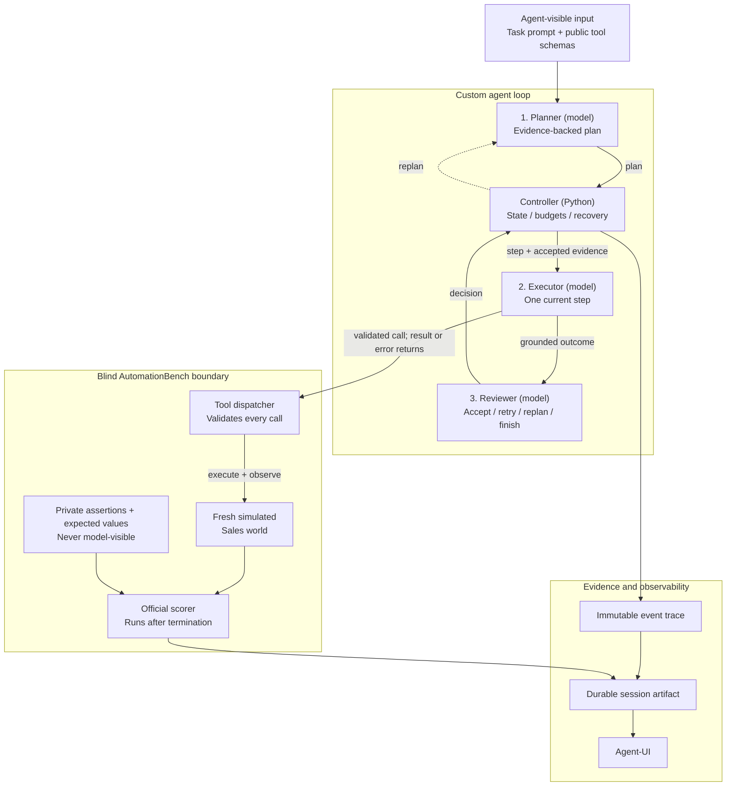

# Sales Planner-Executor Case Study

A narrow, framework-free agent that plans and executes long-running Sales workflows against
AutomationBench. The custom Python controller owns planning, tool dispatch, recovery, budgets,
termination, and tracing; the model never receives benchmark answers or raw world state.

## Quick start

Requires Python 3.13 and `uv`. Put `LIBRA_INTERVIEW_API_KEY` and `LIBRA_BASE_URL` in either the
repository `.env` or `mock-agent/.env`, then install both applications:

```bash
cd mock-agent
uv sync
cd ../Agent-UI
uv sync
```

Run the evaluator UI:

```bash
cd Agent-UI
uv run agent-ui
```

Open <http://127.0.0.1:8000>, select a task and the custom runtime, then start the execution. The
left pane reads durable JSON sessions from `sessions/`; refreshing the browser does not lose a
finished trace.

Run one task without the UI:

```bash
cd mock-agent
uv run mock-agent \
  --task-id sales.zoom_calendar_conflict \
  --output results/development/example.json
```

Run or resume the frozen held-out panel and make every observation available in Agent-UI history:

```bash
cd mock-agent
uv run mock-agent-eval run \
  --manifest evaluation/manifest.json \
  --config evaluation/config.json \
  --repetitions 10 \
  --artifacts-dir results/evaluation \
  --sessions-dir ../sessions
```

Regenerate both reports without calling the model:

```bash
uv run mock-agent-eval report \
  --artifacts-dir results/evaluation \
  --markdown results/evaluation/report.md \
  --json results/evaluation/report.json \
  --task-id sales.contract_renewal_coordinator \
  --task-id sales.event_to_opportunity_pipeline \
  --task-id sales.full_sales_cycle_orchestrator \
  --task-id sales.cross_platform_account_health_score \
  --task-id sales.demo_scheduling
```

## How the agent works



The central design choice is the boundary between model judgment and deterministic control: the
model proposes a plan, performs one step, and reviews the evidence, while Python owns transitions,
budgets, validation, recovery, tracing, and access to tools. Private benchmark answers reach only
the scorer after execution; the model sees only the task, public schemas, and observed results.

The planner returns at most six ordered steps. Each step names its objective and the declared
tools that can supply completion evidence. The executor receives one current step and may issue
multiple calls in one turn; arguments are validated locally and calls execute in emitted order.
The planner then reviews the grounded outcome and chooses `step_completed`, `retry_step`,
`replan`, or `goal_completed`. Only the last decision may contain the user-facing response.

The Python controller, rather than the model, owns transitions and limits. A step gets four
tool-capable executor turns plus one tool-free outcome call, one rejected step may be retried, one
remaining plan may be replaced, and the full run gets 30 logical model calls. Two short transport
retries do not consume that logical budget. Terminal reasons distinguish completion, budget
exhaustion, cancellation, provider failure, protocol failure, and unexpected runtime failure.

## Information and blindness boundaries

The adapter privately owns the task ID, expected values, assertions, initial and mutable world,
bound tool functions, and official scorer. Model requests contain only benchmark prompt messages,
public tool schemas, observed tool results/errors, the current plan, accepted evidence, recovery
records, and remaining budgets. The scorer runs only after execution. Held-out labels, repetition
numbers, previous outcomes, raw world state, and assertion data never enter model-visible context.

The immutable trace retains every model turn, plan, step, call, result, error, review, retry,
replan, usage value, correlation ID, and duration. Model-visible context is smaller: after an
accepted step, its transcript becomes exact structured facts and source call IDs; before a replan,
a failed attempt becomes a record of actions, useful facts, errors, and side effects that must not
repeat. Ordinary executor turns and the single retry retain their local transcript. There is no
arbitrary truncation, vector retrieval, hidden provider conversation, or lossy trace compression.

Unknown tools, invalid arguments, and tool exceptions are returned as structured observations.
Side-effecting tools are never retried automatically. Provider failures receive only bounded
transport retries. Cancellation is cooperative at model and completed tool-batch boundaries so an
in-flight batch is not partially abandoned.

## Evaluation protocol

Development used only `sales.update_contact_phone`, `sales.negative_selection`,
`sales.dependency_chain`, and `sales.zoom_calendar_conflict`. The repository owner supplied and
preregistered the ten different tasks in
[`mock-agent/evaluation/manifest.json`](mock-agent/evaluation/manifest.json). The model, harness,
prompts, protocol, and execution limits are frozen in
[`mock-agent/evaluation/config.json`](mock-agent/evaluation/config.json).

The evaluator runs ten sequential scorable repetitions for each task, always from a fresh world.
Every terminal agent observation—including incorrect completion, budget exhaustion, protocol
failure, and agent-caused runtime failure—counts. An exhausted transient endpoint attempt is
infrastructure-invalid: it is replaced, is not assigned a repetition, and cannot enter the report.
Each accepted observation is written atomically before the next begins. Resumption skips existing
configuration/task/repetition triples and reconstructs a missing Agent-UI history copy without
calling the model again.

Reports keep strict completion as count and percentage, partial-credit mean/sample standard
deviation/range, token and duration median/range, model-turn and tool-call efficiency, runs with
tool errors, termination counts, task coverage, and artifact links. Aggregation is isolated by the
full configuration hash and includes both overall-panel and per-task summaries. Repeated
`--task-id` options select a report subset without mutating the immutable observations.

## Held-out results

The repository owner reduced the final reported scope after collection began. The checked-in
report therefore covers the first five manifest tasks, with ten scorable repetitions each. All 61
completed observations remain committed for traceability—six complete task blocks and one run from
the seventh task—but the additional 11 are explicitly excluded from this 50-run aggregate.

| Task | Strict | Partial mean (SD) | Runs with tool errors |
| --- | ---: | ---: | ---: |
| `sales.contract_renewal_coordinator` | 0/10 | 0.087 (0.236) | 10 |
| `sales.event_to_opportunity_pipeline` | 1/10 | 0.850 (0.143) | 0 |
| `sales.full_sales_cycle_orchestrator` | 3/10 | 0.388 (0.502) | 9 |
| `sales.cross_platform_account_health_score` | 0/10 | 0.150 (0.324) | 10 |
| `sales.demo_scheduling` | 0/10 | 0.000 (0.000) | 8 |

Overall strict completion was 4/50 (8.0%), with mean partial credit 0.295 (sample SD 0.418).
Median usage was 124,028.5 tokens and median duration was 251,361.595 ms. Termination was dominated
by budget exhaustion (33 runs), followed by claimed goal completion (15) and model protocol errors
(2); 37/50 runs contained tool errors. The full deterministic outputs are
[`report.md`](mock-agent/results/evaluation/report.md) and
[`report.json`](mock-agent/results/evaluation/report.json).

The traces expose three recurring weaknesses. First, unsupported Salesforce query forms caused
repeated errors in renewal and account-health work, consuming budgets before downstream writes.
Second, claimed completion was not reliable evidence of correctness: the event pipeline had nine
`goal_completed` terminations but only one strict success, most often missing its required ChatGPT
conversation. Third, long cross-platform workflows were brittle: full-cycle runs had high outcome
variance and repeated Slack search/Salesforce query failures, while demo scheduling produced none
of its required Zoom or Slack assertions. Across the 50 runs, 46 bounded provider retries also
reinforced the cost of sequential, model-heavy control.

This is evidence about one frozen configuration on a deliberately narrowed five-task slice, not a
claim of general Sales-agent quality. The clearest next iteration would improve query construction
and error-directed recovery, then compare a newly frozen configuration on a new held-out panel.

## Development evidence

The complete real execution at
[`sessions/20260716T172740707091Z_sales-zoom_calendar_conflict_edfb3d96.json`](sessions/20260716T172740707091Z_sales-zoom_calendar_conflict_edfb3d96.json)
strictly completed its task with partial credit 1.0. Its 52 events preserve a four-step plan, 15
executor turns, 13 correlated calls/results, four reviews, the final response, initial/final
worlds, and official assertion evidence. It used 88,594 tokens and changed only the simulated
world.

Development evaluation justified four concrete changes before preregistration: plans now bind
evidence requirements to declared source tools; a saturated executor receives a reserved tool-free
outcome call; reviewers receive the full current plan before accepting completion; and retry/replan
records protect successful side effects without incorrectly blocking harmless reads. These changes
were frozen as `planner-executor/0.3.0` with prompt version `planner-executor-prompts/v2`.

## Scope and tradeoffs

This is intentionally not a reusable agent platform. It has one Sales domain, one provider API,
one linear planner, sequential tool execution, one retry, one replan, local JSON persistence, and
deterministic benchmark scoring. It does not implement DAG scheduling, subagents, multi-provider
routing, durable workers, a database, human approval, long-term memory, retrieval, semantic cache,
automatic prompt optimization, an LLM judge, or a live aggregate dashboard.

The main simplicity tradeoffs are higher token use from explicit reviewer calls and full local
step transcripts, slower evaluation from sequential execution, and coarse fixed budgets instead
of learned stopping. Given more time, priorities are: reduce repeated prompt/tool-schema tokens,
improve evidence-first query planning for large noisy tool sets, add explicit provider timeouts,
compare prompt/config versions on a new preregistered panel, and introduce human approval only for
real external side effects.

## Repository guide

- `mock-agent/src/mock_agent/`: blind adapter, direct provider client, planner-executor, contracts,
  and offline evaluation/reporting.
- `Agent-UI/`: local execution workspace and durable history/evidence inspector.
- `AutomationBench/`: Sales tasks, tools, simulated worlds, and official deterministic scorer.
- `mock-agent/results/evaluation/`: persisted held-out observations and generated reports.
- `sessions/`: UI-compatible single-run and batch artifacts.

Run automated checks with `uv run pytest` from both `mock-agent/` and `Agent-UI/`.
