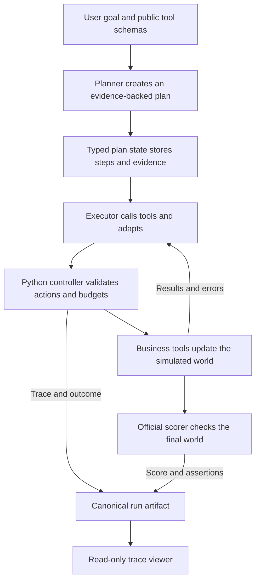

# Sales Plan-State Agent

A framework-free Python research implementation for long-running, multi-step tool-use tasks. Given
a high-level goal and a set of tools, the agent creates a plan, executes it through a continuous
ReAct-style loop, revises the plan when new information invalidates it, and returns an
evidence-backed result.

The project uses [AutomationBench](vendor/automationbench/UPSTREAM_README.md) for complex simulated
business workflows and deterministic scoring while keeping expected outcomes hidden from the
model.

## Architecture



The model owns planning, tool selection, and adaptation. The Python harness owns state
transitions, tool validation, recovery policy, execution limits, termination, and tracing.

1. **Plan.** The planner receives the task prompt and public schemas for the available tools.
2. **Execute.** The executor may issue sequential business-tool calls or exactly one harness
   control: `complete_step`, `revise_plan`, or `finish`.
3. **Ground progress in evidence.** Every evidence requirement must map to a compatible,
   successful tool call made while its step was active.
4. **Adapt without forgetting.** Plan revisions preserve completed steps and accepted evidence.
5. **Recover predictably.** Tool and protocol failures become structured observations. Run-level
   budgets limit model turns, tool calls, revisions, elapsed time, and no-progress turns.
6. **Keep evaluation blind.** Benchmark assertions, expected values, raw world state, and scoring
   stay behind the adapter. The execution artifact retains a complete trace for inspection.

## Design decisions

- **Benchmark-led development.** AutomationBench supplies complex workflows and deterministic
  scoring, making regressions measurable without exposing answers to the runtime.
- **A framework-free control loop.** An early LangGraph prototype validated the benchmark adapter;
  the current runtime implements planning, evidence, recovery, and termination directly.
- **Deterministic runtime policy.** The model cannot change its own budgets, state-transition
  rules, or evidence requirements during a run.
- **Artifact-first observability.** The CLI, evaluator, reporter, and viewer consume the same
  immutable `RunArtifact` rather than maintaining separate session representations.
- **Sequential, resumable evaluation.** Each observation is written before the next begins, so an
  interrupted evaluation can resume safely while respecting provider rate limits.
- **Deliberately narrow scope.** The project focuses on control, recovery, evidence, and
  evaluation. Memory, retrieval, subagents, DAG scheduling, and multi-provider routing remain
  future work.

## Evaluation results

The reference evaluation ran `plan-state/1.0.0` ten times on each of five Sales tasks, producing 50
scorable observations from fresh simulated worlds. The agent completed 18 of 50 runs strictly
(36%) and achieved a mean partial-credit score of 0.681. The previous measured runtime completed
4 of 50 runs strictly (8%) with mean partial credit of 0.295.

Recovery was the dominant concern: 46 of 50 current-runtime runs contained at least one tool
error. A useful runtime must make those failures observable, preserve successful work, and give the
model bounded opportunities to change strategy.

- [Evaluation analysis](EVALUATION_RESULTS.md)
- [Generated five-task report](results/evaluation/plan-state-v1-five-task/report.md)

## Example run

The [`sales.zoom_calendar_conflict` artifact](results/runs/3260560e-e3ac-4cbe-abeb-b5abb92f0a47.json)
follows a current-runtime task from its initial prompt through official scoring. The agent
inspected the meeting-priority policy and both conflicting records, preserved the higher-priority
Calendar event, renamed the lower-priority Zoom meeting, and posted the required Slack summary.
It recovered from tool errors, terminated with `goal_completed`, and received an official
strict-completion score of 1.0.

## Quick start

The project requires Python 3.13 and [`uv`](https://docs.astral.sh/uv/).

```bash
uv sync --frozen --all-groups
cp .env.example .env
```

Configure an OpenAI-compatible model provider in the repository-root `.env`:

```dotenv
SALES_AGENT_PROVIDER_API_KEY=replace-with-your-provider-api-key
SALES_AGENT_PROVIDER_BASE_URL=https://replace-with-your-provider-endpoint.example/v1
```

Optional settings are `SALES_AGENT_MODEL`, `SALES_AGENT_TIMEOUT_SECONDS`, and
`SALES_AGENT_PROVIDER_RETRIES`. Their defaults and accepted ranges are documented in
[`.env.example`](.env.example). Running tasks and evaluations requires provider credentials; the
viewer, reporter, and test suite do not call a model.

Start the read-only trace viewer:

```bash
uv run sales-agent viewer
```

Then run a task in another terminal:

```bash
uv run sales-agent run --task-id sales.zoom_calendar_conflict
```

The command prints the task status, termination reason, official score, artifact path, and stable
viewer URL.

## Interfaces

| Interface | Purpose | Mutates simulated state? |
| --- | --- | --- |
| `sales-agent run` | Execute one Sales task with the default `plan-state/1.0.0` runtime. | Yes |
| `sales-agent evaluate` | Run or resume a manifest across repeated fresh worlds. | Yes |
| `sales-agent report` | Validate coverage and generate Markdown and JSON statistics. | No |
| `sales-agent viewer` | Browse immutable artifacts and inspect individual runs. | No |
| `RunArtifact` JSON | Shared evidence contract for every project interface. | No |

The browser interface is intentionally read-only. Execution belongs to the CLI and evaluator; the
viewer reads canonical artifacts directly.

### Run one task

The default task is `sales.zoom_calendar_conflict`, so the minimal command is:

```bash
uv run sales-agent run
```

Use `--task-id` to select another Sales task, `--model` to override the configured model,
`--output` to choose an exact artifact filename, `--artifacts-dir` to change the destination, and
`--viewer-base-url` when the viewer uses a non-default address. Each invocation starts from a fresh
AutomationBench world and writes exactly one terminal artifact without overwriting existing runs.

### Run or resume an evaluation

Use the one-task fixture to check the complete evaluation path:

```bash
uv run sales-agent evaluate \
  --manifest evaluation/manifest.example.json \
  --config evaluation/config.example.json \
  --repetitions 1 \
  --artifacts-dir results/development/evaluation-smoke
```

Run the 50-observation reference panel with:

```bash
uv run sales-agent evaluate \
  --manifest evaluation/manifest.historical-five-task.json \
  --config evaluation/config.json \
  --repetitions 10 \
  --artifacts-dir results/evaluation/plan-state-v1-five-task
```

Agent-caused failures remain scorable. Infrastructure-invalid attempts may be replaced at most
twice. Reissuing the same command resumes from canonical artifacts and skips only complete,
scorable configuration/task/repetition triples.

### Generate the report

```bash
uv run sales-agent report \
  --manifest evaluation/manifest.historical-five-task.json \
  --config evaluation/config.json \
  --repetitions 10 \
  --artifacts-dir results/evaluation/plan-state-v1-five-task \
  --markdown results/evaluation/plan-state-v1-five-task/report.md \
  --json results/evaluation/plan-state-v1-five-task/report.json
```

Final reporting rejects missing, duplicate, unexpected, out-of-range, or mixed-configuration
observations. Deliberately filtered analysis requires `--exploratory` and is labeled incomplete.

## Artifacts and trace viewer

`run_artifact` schema version 1 records the task and tool snapshot, frozen configuration, lifecycle
and termination data, correlated trace, usage, final response or error, initial and final worlds,
official score, and assertion evidence. Artifacts are assembled in memory and created atomically
only after execution reaches a terminal outcome. Existing destinations are never replaced.

Authoritative locations are:

- `results/runs/` for standalone CLI runs;
- `results/evaluation/` for evaluation observations and reports; and
- `results/development/` for selected development evidence.

The viewer scans `results/` recursively and serves each artifact at `/runs/{run-id}`. Viewer
requests never create, copy, or modify artifacts.

## Repository guide

| Path | Responsibility |
| --- | --- |
| [`src/sales_agent/plan_state_runtime.py`](src/sales_agent/plan_state_runtime.py) | Planner, executor, finalizer, and continuous execution loop. |
| [`src/sales_agent/plan_state.py`](src/sales_agent/plan_state.py) | Typed plan, evidence, completion, and revision transitions. |
| [`src/sales_agent/adapter.py`](src/sales_agent/adapter.py) | Blind task, tool, world, and scorer boundary. |
| [`src/sales_agent/runtime_support.py`](src/sales_agent/runtime_support.py) | Budgets, lifecycle, tracing, provider recovery, and outcomes. |
| [`src/sales_agent/artifacts.py`](src/sales_agent/artifacts.py) | Canonical schema, validation, and atomic write-once storage. |
| [`src/sales_agent/evaluation/`](src/sales_agent/evaluation/) | Evaluation runner, records, coverage validation, and reporting. |
| [`src/sales_agent/viewer/`](src/sales_agent/viewer/) | Read-only artifact repository and HTML trace viewer. |
| [`vendor/automationbench/`](vendor/automationbench/) | Pinned benchmark, simulated tools and worlds, scorer, and provenance. |
| [`evaluation/`](evaluation/) | Frozen manifests and versioned evaluation configurations. |
| [`results/`](results/) | Canonical run evidence and generated reports. |

Focused documentation is available in [`docs/agent.md`](docs/agent.md),
[`docs/run-artifacts.md`](docs/run-artifacts.md), and [`docs/viewer.md`](docs/viewer.md).

## Roadmap

1. Improve schema-aware query construction and error-directed recovery using recurring failures as
   regression cases.
2. Measure deterministic context projection while retaining the complete immutable trace.
3. Compare prompt and runtime changes on fresh preregistered panels.
4. Extend evaluation to generated text with calibrated semantic and deterministic checks.
5. Explore scoped subagents, process memory, and provider fallbacks after establishing measurable
   correctness and cost criteria.
6. Add approvals, idempotency, access controls, and stronger process recovery before connecting the
   runtime to consequential external systems.

## Verification

```bash
uv run ruff format --check src tests
uv run ruff check src tests
uv run ty check src/sales_agent
uv run pytest
```

The tests exercise the plan-state runtime through scripted model responses, real AutomationBench
tools and scoring, evaluation resumption and reporting, artifact persistence, configuration
validation, and viewer routes. They require no model API key. The viewer accessibility smoke test
uses Playwright; if neither local Chrome nor Playwright Chromium is available, install the latter
with `uv run playwright install chromium`.
